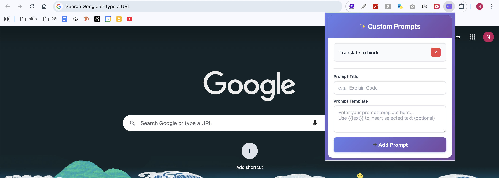
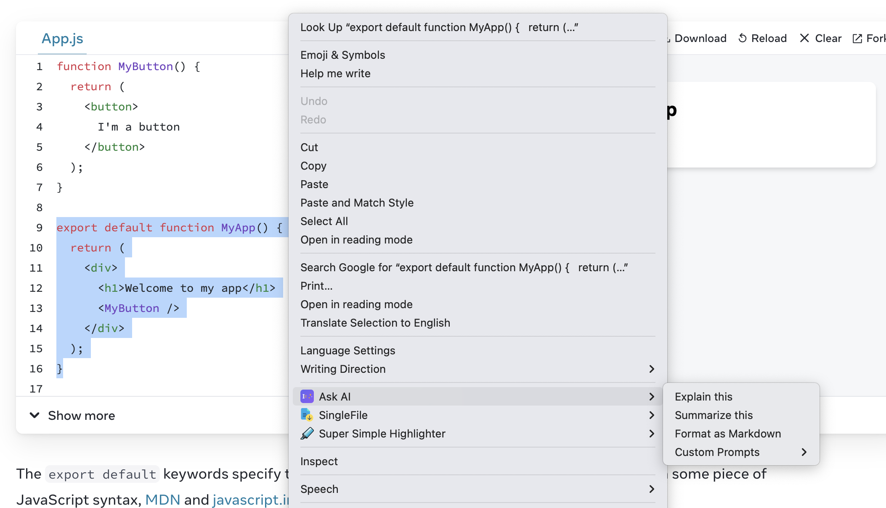

# AI Text Explainer

A Chrome extension that allows you to quickly send selected text to ChatGPT with custom prompts. Simply right-click on any selected text and choose from built-in prompts or your own custom prompts to get AI-powered explanations, summaries, and more.

## Features

- 🚀 **Quick Access**: Right-click on any selected text to access AI prompts
- 📝 **Built-in Prompts**: Pre-configured prompts for common tasks:
  - **Explain this**: Get explanations for selected text
  - **Summarize this**: Get concise summaries
  - **Format as Markdown**: Convert text to well-structured markdown
- ✨ **Custom Prompts**: Create and manage your own prompt templates
- 💾 **Persistent Storage**: Your custom prompts are saved and synced across devices
- 🎨 **Modern UI**: Beautiful, intuitive interface for managing prompts

## Installation

### From Source (Developer Mode)

1. **Download or Clone** this repository to your local machine

2. **Open Chrome Extensions Page**:
   - Open Google Chrome
   - Navigate to `chrome://extensions/`
   - Or go to Menu (⋮) → Extensions → Manage Extensions

3. **Enable Developer Mode**:
   - Toggle the "Developer mode" switch in the top-right corner

4. **Load the Extension**:
   - Click "Load unpacked"
   - Select the folder containing the extension files
   - The extension should now appear in your extensions list

5. **Pin the Extension** (Optional):
   - Click the puzzle piece icon (🧩) in Chrome's toolbar
   - Find "AI Text Explainer" and click the pin icon to keep it accessible

## How to Use

### Using Built-in Prompts

1. **Select Text**: Highlight any text on any webpage
2. **Right-Click**: Right-click on the selected text
3. **Choose Prompt**: 
   - Click on "Ask AI" in the context menu
   - Select one of the built-in prompts:
     - **Explain this**: Opens ChatGPT with a prompt asking to explain the selected text
     - **Summarize this**: Opens ChatGPT with a prompt asking to summarize the text
     - **Format as Markdown**: Opens ChatGPT with a prompt to format the text as markdown
4. **ChatGPT Opens**: A new tab opens with ChatGPT, and your selected text is automatically inserted with the chosen prompt

### Creating Custom Prompts

1. **Open Extension Popup**:
   - Click the extension icon in your Chrome toolbar
   - Or right-click the extension icon and select "AI Text Explainer"

2. **Add a New Prompt**:
   - Enter a **Prompt Title** (e.g., "Translate to Spanish", "Fix Grammar")
   - Enter a **Prompt Template** in the text area
   - Click "➕ Add Prompt"

3. **Use Your Custom Prompt**:
   - Select text on any webpage
   - Right-click → "Ask AI" → "Custom Prompts" → Your custom prompt name
   - ChatGPT opens with your custom prompt and the selected text

### Managing Custom Prompts

- **View All Prompts**: Open the extension popup to see all your custom prompts
- **Delete a Prompt**: Click the "×" button next to any custom prompt in the popup
- **Edit Prompts**: Currently, you need to delete and recreate a prompt to modify it

## Prompt Template Examples

### Example 1: Translation
- **Title**: Translate to Spanish
- **Template**: `Translate the following text to Spanish:\n\n`

## How It Works

1. The extension adds a context menu item ("Ask AI") that appears when you select text
2. When you choose a prompt, it combines the prompt template with your selected text
3. It opens a new Chrome tab with ChatGPT, automatically inserting the combined prompt and text
4. Your custom prompts are stored in Chrome's sync storage, so they're available across all your devices

## Screenshots

## Contributing

Feel free to submit issues, fork the repository, and create pull requests for any improvements.

## License

This project is open source and available for use and modification.

---

